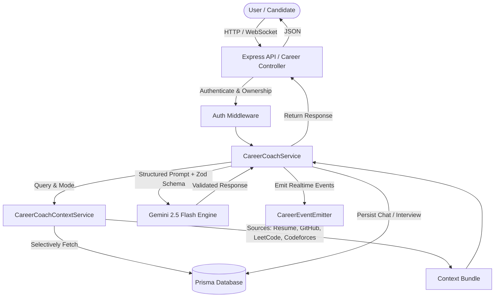
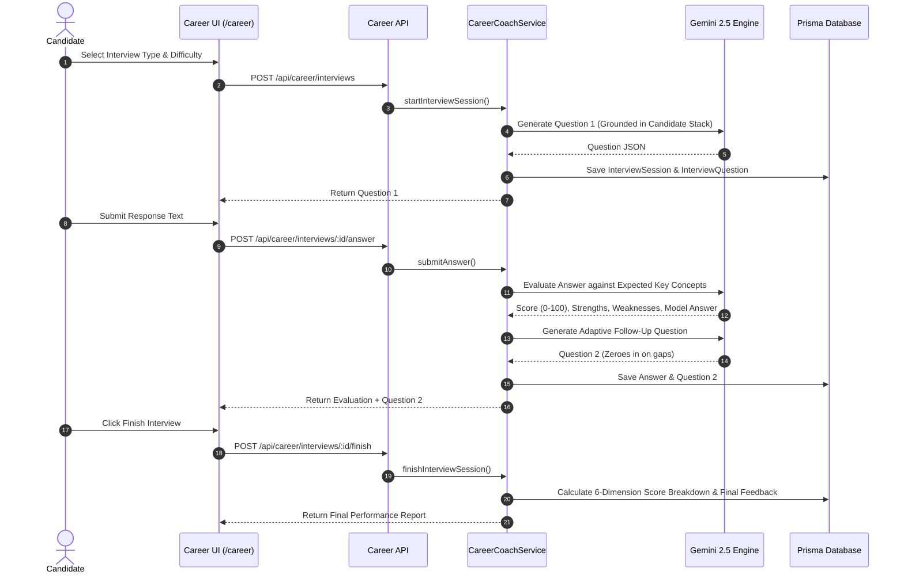

# Part 20 — AI Career + Interview Coach Architecture & Documentation

## Overview

**AI Career + Interview Coach** is the conversational intelligence layer of NexusFlow. It enables candidates to interact naturally with their connected developer data to answer career questions, review profiles, practice interactive mock interviews, and receive real-time answer evaluations.

The system powers 9 active modes:
1. **General Career Chat**: Open-ended software engineering career queries.
2. **Career Mentor**: High-level growth strategies, career positioning, and promotion guidance.
3. **Job Coach**: Job-specific guidance based on connected Job Description, Match, and Readiness reports.
4. **Resume Reviewer**: ATS optimization, bullet point impact verification, and resume positioning.
5. **GitHub Reviewer**: Repository structure analysis, code quality, and project presentation.
6. **Learning Coach**: Targeted DSA and technical study plans based on LeetCode/Codeforces stats.
7. **Placement Coach**: Campus and off-campus placement drive preparation and company strategies.
8. **Interview Coach**: Technical concept practice, STAR behavioral responses, and interview prep.
9. **Mock Interview Simulator**: Real-time multi-question mock interviews with 0–100 scoring and model answer comparison.

---

## Core Principles & Anti-Hallucination Guardrails

1. **Grounded in Verified Data**: All answers derive strictly from verified evidence stored across connected platforms (Resume, GitHub, LeetCode, Codeforces, Portfolio, Job Match, Job Readiness, Company Preparation).
2. **Source Transparency**: Every response exposes a `sourcesUsed` array listing only the verified platforms consulted.
3. **No Fabrication**: The AI never invents candidate experience, GitHub projects, contest ratings, or hiring outcomes. If data is unavailable, the system states: *"That information is not available in your connected profile."*
4. **Context Budgeting**: A dedicated `CareerCoachContextService` selectively loads only the data required for the user's specific query to optimize context usage and response speed.

---

## Architecture Diagram



---

## Interactive Mock Interview Flow



---

## Data Schema & Models

### `career_chats` & `career_chat_messages`
```prisma
model CareerChat {
  id          String              @id @default(uuid())
  userId      String
  jobId       String?
  title       String
  mode        String              @default("GENERAL_CAREER_CHAT")
  createdAt   DateTime            @default(now())
  updatedAt   DateTime            @updatedAt

  messages    CareerChatMessage[]
  user        User                @relation(fields: [userId], references: [id], onDelete: Cascade)
  job         JobDescription?     @relation(fields: [jobId], references: [id], onDelete: SetNull)

  @@index([userId, createdAt])
  @@map("career_chats")
}

model CareerChatMessage {
  id              String      @id @default(uuid())
  chatId          String
  sender          String      // 'USER' | 'ASSISTANT' | 'SYSTEM'
  content         String      @db.Text
  mode            String?
  sourcesUsed     Json?       // string[]
  evidence        Json?       // string[]
  recommendations Json?       // string[]
  score           Float?      // 0-100
  evaluation      Json?       // evaluation breakdown
  createdAt       DateTime    @default(now())

  chat            CareerChat  @relation(fields: [chatId], references: [id], onDelete: Cascade)

  @@index([chatId, createdAt])
  @@map("career_chat_messages")
}
```

### `interview_sessions`, `interview_questions` & `interview_answers`
```prisma
model InterviewSession {
  id            String              @id @default(uuid())
  userId        String
  jobId         String?
  interviewType String              @default("Technical")
  difficulty    String              @default("Medium")
  status        String              @default("IN_PROGRESS")
  overallScore  Float?              @default(0.0)
  scoreBreakdown Json?
  finalFeedback String?             @db.Text
  startedAt     DateTime            @default(now())
  completedAt   DateTime?
  createdAt     DateTime            @default(now())
  updatedAt     DateTime            @updatedAt

  questions     InterviewQuestion[]
  user          User                @relation(fields: [userId], references: [id], onDelete: Cascade)
  job           JobDescription?     @relation(fields: [jobId], references: [id], onDelete: SetNull)

  @@index([userId, createdAt])
  @@map("interview_sessions")
}
```

---

## REST Endpoints Summary

| Method | Endpoint | Description |
|---|---|---|
| `POST` | `/api/career/chats` | Create a new career chat session. |
| `GET` | `/api/career/chats` | List user's career chat sessions. |
| `GET` | `/api/career/chats/:chatId` | Get details and message stream for a chat session. |
| `POST` | `/api/career/chats/:chatId/messages` | Send a message to the AI Coach and receive grounded response. |
| `DELETE` | `/api/career/chats/:chatId` | Delete a chat session. |
| `GET` | `/api/career/metrics` | Retrieve career strength & readiness KPI metrics. |
| `POST` | `/api/career/interviews` | Start a new mock interview session and generate Question 1. |
| `GET` | `/api/career/interviews` | List user's interview sessions. |
| `GET` | `/api/career/interviews/:sessionId` | Get interview session details and Q&A history. |
| `POST` | `/api/career/interviews/:sessionId/answer` | Submit an answer, receive 0-100 evaluation, and generate adaptive follow-up. |
| `POST` | `/api/career/interviews/:sessionId/finish` | Conclude session and generate 6-dimension score breakdown. |

---

## Security & Verification

- **IDOR Protection**: Authenticated user ownership (`assertResourceOwnership`) is strictly validated on all chat and interview session endpoints.
- **Strict Validation**: Request parameters and Gemini responses are validated using Zod schemas (`CareerCoachResponseSchema`, `InterviewQuestionSchema`, `InterviewEvaluationSchema`).
- **Deterministic Metrics Guarantee**: Platform scores (such as LeetCode problem counts or Job Match scores) remain deterministic and cannot be modified by LLM outputs.
