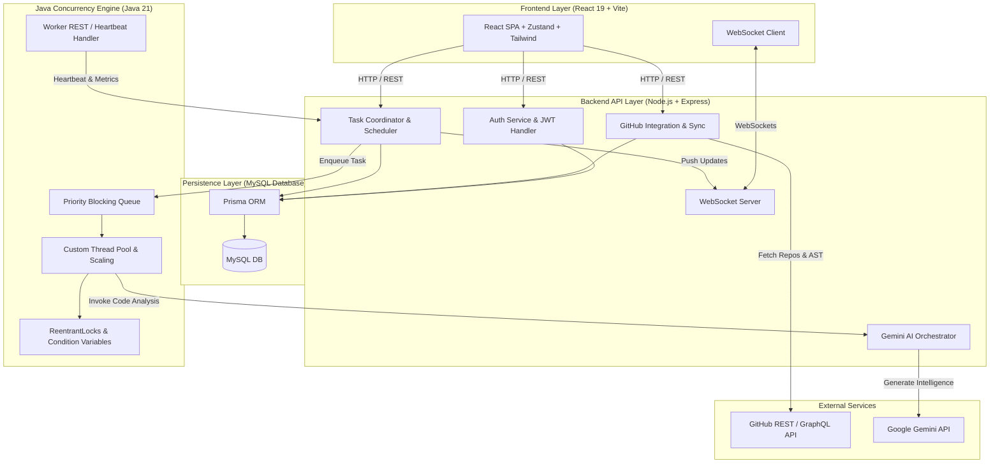
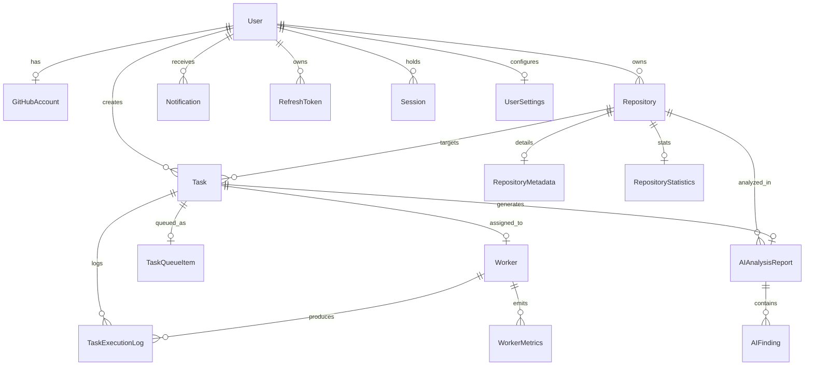

# NexusFlow — Architectural & Database Specification Document

## 1. High-Level Architecture Overview

NexusFlow is a high-throughput, AI-powered developer intelligence SaaS platform. The system ingests public/private GitHub repositories, schedules automated static code and architecture checks, executes concurrency-bound heavy analysis tasks via a custom Java worker engine, and provides real-time progress monitoring and deep AI-driven health reports leveraging Gemini AI.

### Core System Diagram



---

## 2. Complete Folder Structure

```
nexusflow/
├── docs/
│   ├── ARCHITECTURE.md
│   ├── API_SPEC.md
│   └── JAVA_WORKER_SPEC.md
├── frontend/
│   ├── src/
│   │   ├── assets/
│   │   ├── components/
│   │   │   ├── common/         # Buttons, Badges, Modals, Spinners
│   │   │   ├── layout/         # Navbar, Sidebar, Header, Footer
│   │   │   ├── dashboard/      # Health scores, charts, recent activities
│   │   │   ├── repository/     # Repo list, import dialog, tree viewer
│   │   │   ├── tasks/          # Task queue table, priority badge, progress bar
│   │   │   ├── worker/         # Real-time worker thread monitor, CPU/RAM charts
│   │   │   └── reports/        # Gemini analysis report viewer, findings list
│   │   ├── hooks/              # Custom hooks (useAuth, useTasks, useWebSocket)
│   │   ├── pages/              # Landing, Dashboard, Repos, Tasks, Workers, Settings
│   │   ├── services/           # Axios instance, API client functions
│   │   ├── store/              # Zustand state stores (authStore, taskStore, workerStore)
│   │   ├── types/              # TypeScript frontend interfaces & DTOs
│   │   ├── utils/              # Formatters, date helpers, chart calculators
│   │   ├── App.tsx
│   │   └── main.tsx
│   ├── package.json
│   ├── tailwind.config.ts
│   └── vite.config.ts
├── backend/
│   ├── src/
│   │   ├── config/             # Environment variables, database, constants
│   │   ├── controllers/        # Pure REST controllers (Request/Response mapping)
│   │   ├── dtos/               # Zod schemas for input validation & DTO mapping
│   │   ├── middlewares/        # Auth, RateLimiter, ErrorHandler, Logger, CSRF
│   │   ├── repositories/       # Prisma data access layer (Repository Pattern)
│   │   ├── routes/             # Express API route declarations
│   │   ├── services/           # Business logic layer (Service Pattern)
│   │   ├── websocket/          # Socket server, connection rooms, event broadcasters
│   │   ├── utils/              # Crypto, JWT tokens, Winston logger
│   │   ├── app.ts
│   │   └── server.ts
│   ├── prisma/
│   │   └── schema.prisma
│   ├── package.json
│   └── tsconfig.json
├── worker/
│   ├── src/
│   │   ├── main/
│   │   │   └── java/
│   │   │       └── com/nexusflow/worker/
│   │   │           ├── core/       # Custom ThreadPool, Custom BlockingQueue, Locks
│   │   │           ├── scheduler/  # Priority Scheduling, Retry Queue, Delay Queue
│   │   │           ├── task/       # Task execution handlers, Gemini analyzer runner
│   │   │           ├── monitor/    # Heartbeat emitter, System metrics collector
│   │   │           ├── config/     # Worker settings, Thread limits
│   │   │           └── WorkerApplication.java
│   └── pom.xml
├── .env.example
├── .gitignore
├── README.md
└── package.json
```

---

## 3. Database Entity-Relationship (ER) Design



---

## 4. Model Explanations & Responsibility Matrix

1. **User**: Represents developer accounts, role-based authorization (USER / ADMIN), status, and profile information.
2. **GitHubAccount**: Stores encrypted GitHub OAuth access tokens, profile metrics, and synchronization state. Sensitive tokens are isolated here.
3. **Repository**: Tracks GitHub repository metadata (owner, repo name, stars, default branch, clone URL).
4. **RepositoryMetadata**: Tracks supplementary GitHub flags (archived status, licensing, topic tags, branch SHAs).
5. **RepositoryStatistics**: Stores roll-up health aggregates (lines of code, total PRs, commit count, cumulative health score).
6. **Task**: Core unit of background work. Manages task state (`QUEUED`, `RUNNING`, `COMPLETED`, `FAILED`, `RETRYING`), priority weight, and worker assignments.
7. **TaskQueueItem**: Priority queue indexing model for efficient worker task claiming.
8. **Worker**: Real-time record of active Java concurrency nodes, heartbeat status (`IDLE`, `BUSY`, `UNHEALTHY`), and thread availability.
9. **WorkerMetrics**: Time-series performance logs (CPU %, RAM %, queue depth, throughput) for monitoring dashboard charts.
10. **TaskExecutionLog**: Detailed step-by-step logs emitted during task execution.
11. **AIAnalysisReport**: Aggregated multi-dimensional scores (Security, Performance, Architecture, Maintainability, Documentation) generated by Gemini.
12. **AIFinding**: Individual actionable issues identified by AI (Severity, category, file path, line number, code recommendation).
13. **Notification**: User-facing alerts for task completions, security alerts, and background job state shifts.
14. **RefreshToken**: Cryptographically hashed (SHA-256) refresh tokens supporting rotation and revocation.
15. **Session**: Tracks active user HTTP sessions for security auditing.
16. **UserSettings**: Personalization preferences (theme, notification triggers, webhook integrations).

---

## 5. Relationships & Cascade Rules

- **User → GitHubAccount (1:1)**: `CASCADE` on delete. Deleting a user purges their connected GitHub credentials.
- **User → Repositories (1:N)**: `CASCADE` on delete. Deleting a user removes associated repository records.
- **Repository → Tasks (1:N)**: `CASCADE` on delete. Deleting a repository removes its historical tasks.
- **Task → Worker (N:1)**: `SET NULL` on worker delete or disconnection. If a worker fails/crashes, the task remains intact to be re-queued.
- **Task → Execution Logs (1:N)**: `CASCADE` on delete.
- **Task → AI Analysis Report (1:1)**: `CASCADE` on delete.
- **AI Analysis Report → AI Findings (1:N)**: `CASCADE` on delete.

---

## 6. Indexing Strategy

- **`users(email)` / `users(githubId)`**: Unique indexes for fast OAuth lookup during authentication.
- **`repositories(userId)` / `repositories(owner, name)`**: Composite index for rapid repository listing and lookups.
- **`tasks(status, priority, createdAt)`**: Composite index for priority queue ordering and worker task extraction.
- **`worker_metrics(workerId, timestamp)`**: Composite index for rendering high-speed metrics time-series charts.
- **`task_execution_logs(taskId, timestamp)`**: Composite index for streaming log tails for active tasks.
- **`ai_findings(reportId, severity)`**: Composite index for filtering findings by severity level.

---

## 7. Security Architecture

1. **Authentication**: GitHub OAuth 2.0 flow yielding short-lived JWT access tokens (15 minutes) and HTTP-only, Secure, SameSite=Lax refresh cookies (7 days).
2. **Token Rotation**: Cryptographic SHA-256 token hashing on `refresh_tokens`. Reuse detection invalidates token families.
3. **Data Encryption**: GitHub Access Tokens are encrypted at rest using AES-256-GCM before storage in MySQL.
4. **API Security**: Express backend guarded with `helmet`, `cors` origin restriction, and Zod input validation on all payloads.
5. **Rate Limiting**: IP and user-based bucket rate limiting on `/api/auth` (10 req/min) and heavy AI tasks (5 req/min).

---

## 8. Java Worker Architecture (Concurrency Engine)

The Java service relies on **pure Java 21 concurrency primitives** without standard high-level abstractions:

1. **Custom Priority Blocking Queue**: Built using array heaps, synchronized with a `ReentrantLock` and dual `Condition` variables (`notFull`, `notEmpty`).
2. **Custom Worker Thread Pool**: Manages worker thread lifecycle, dynamic scaling (Core: 4, Max: 16), and thread reuse.
3. **Priority Scheduling**: Tasks are sorted dynamically based on user role (Admin > Standard), task type, and retry age.
4. **Retry Engine**: Exponential backoff delay queue handling retries up to `maxRetries`.
5. **Heartbeat & System Monitor**: Periodic daemon thread measuring JVM heap, system CPU, and emitting heartbeats to Node.js backend.

---

## 9. API Endpoint Structure

- `/api/auth`: GitHub OAuth, Refresh, Logout, Session check.
- `/api/users`: Profile, Settings, Role management.
- `/api/repositories`: GitHub import, Sync, Repo details.
- `/api/tasks`: Create task, Queue status, Task details, Cancel task.
- `/api/workers`: Worker status, Metrics history, Thread usage.
- `/api/analysis`: Fetch reports, Findings, Historical trends.
- `/api/notifications`: Read/Unread notification feeds.

---

## 10. Railway & Local Deployment Strategy

- **Zero Docker Requirement**: Uses native standard build commands.
- **Node.js Service**: Built via `npm run build`, executed via `npm start`.
- **Java Service**: Built via `mvn clean package`, executed via `java -jar target/worker.jar`.
- **MySQL**: Railway provisioned MySQL instance, configured via `DATABASE_URL`.

---

## 11. Development Roadmap

- **Phase 1**: Architecture, Schema design, Database bootstrap (CURRENT).
- **Phase 2**: Express API backend, GitHub OAuth, JWT auth, Prisma repositories.
- **Phase 3**: Java 21 Concurrency Engine, Priority Queue, ThreadPool, Gemini API integration.
- **Phase 4**: React 19 Frontend SPA, Dashboard, Worker monitor, Report viewer.
- **Phase 5**: Real-time WebSockets, Notifications, Final polishes & Railway deployment readiness.
