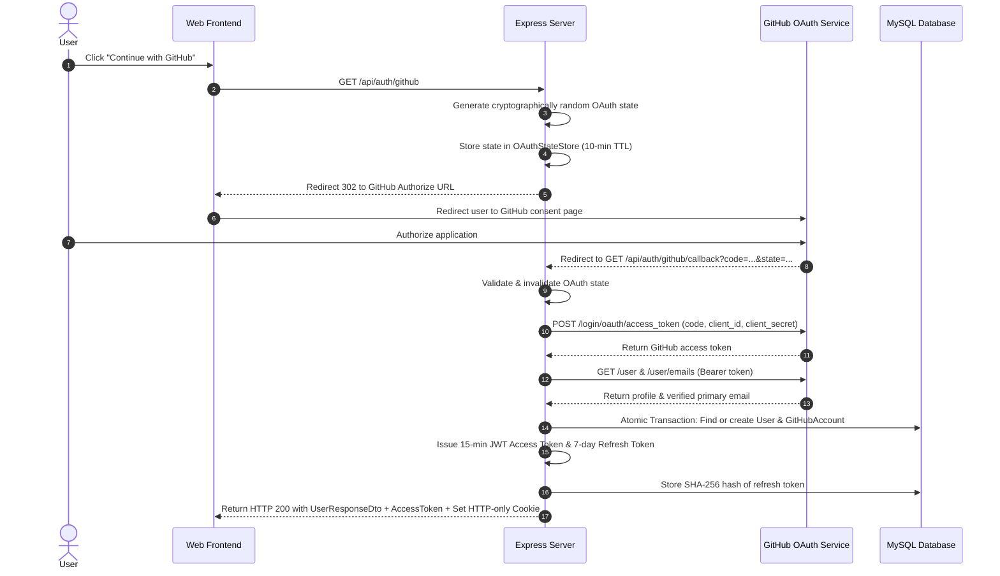
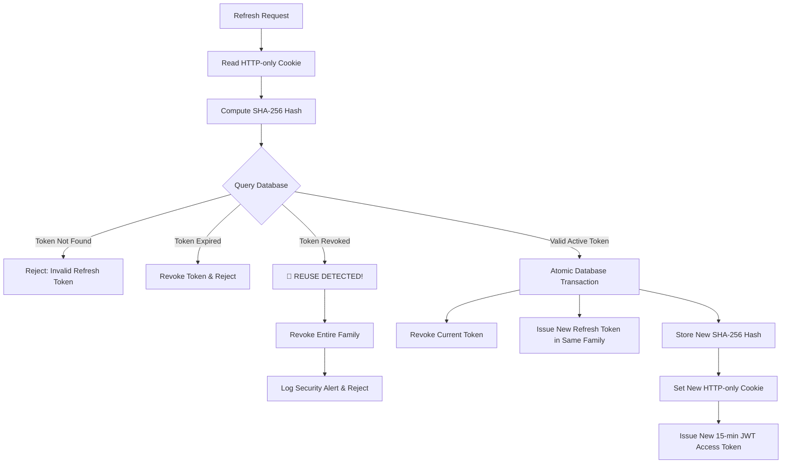

# NexusFlow — Authentication & Authorization System

This document outlines the architecture, security practices, and workflow implementations of the production-grade authentication and authorization engine for **NexusFlow**.

---

## 1. GitHub OAuth 2.0 Flow

NexusFlow utilizes GitHub OAuth 2.0 for developer identity verification.



---

## 2. OAuth State Protection (CSRF Prevention)

OAuth state protection prevents Cross-Site Request Forgery (CSRF) and code injection attacks.

- **Cryptographically Random**: State strings are generated using cryptographically strong random byte generators (`crypto.randomBytes`).
- **Single-Use (Invalidated on Use)**: The state is immediately purged from the `OAuthStateStore` upon first validation attempt, rendering state reuse impossible.
- **Expiration Enforcement**: States expire after 10 minutes. Stale callback requests are automatically rejected with an `UnauthorizedError`.

---

## 3. JWT Access Token Flow

- **Lifetime**: 15 minutes (`15m`).
- **Cryptographic Claims**:
  - `sub`: User UUID
  - `role`: `USER` | `ADMIN`
  - `iss`: `nexusflow-api`
  - `aud`: `nexusflow-app`
  - `iat`: Issued at timestamp
  - `exp`: Expiration timestamp
- **Verification**: Evaluates digital signature, issuer match, audience match, and expiration timestamp on every protected request via `requireAuth` middleware.
- **Security Constraint**: Never includes sensitive credentials, GitHub OAuth tokens, or refresh tokens in the access token payload.

---

## 4. Refresh Token Flow & Storage Strategy

- **Storage**: Plaintext refresh tokens are **NEVER** stored in the database.
- **Hashing**: SHA-256 hashes of refresh tokens are calculated application-side and stored in MySQL (`refresh_tokens` table).
- **Transport**: Transmitted exclusively via HTTP-only cookies (`refreshToken`).

### Cookie Security Attributes:
- `httpOnly: true` (Inaccessible to JavaScript, guarding against XSS attacks)
- `secure: true` in production (Transmitted over HTTPS only)
- `sameSite: 'lax'` (Provides CSRF defense while allowing top-level navigation)
- `path: '/api/auth'` (Scoped strictly to authentication endpoints)
- `maxAge: 604800000` (7 days in milliseconds)

---

## 5. Token Rotation & Reuse Detection

NexusFlow implements strict Refresh Token Rotation with token family tracking.



- **Family ID**: Each refresh token chain shares a `familyId`.
- **Reuse Detection**: If an already-revoked refresh token is presented, the system flags a security intrusion attempt, logs a critical alert in `authLogger`, and revokes **all** active tokens sharing that `familyId`.

---

## 6. Authentication & Authorization Middleware

### Middleware Stack:
1. `requireAuth`: Validates JWT token from `Authorization: Bearer <token>` or fallback cookie, attaching `req.user = { id, role }`.
2. `requireRole('ADMIN')` / `requireAnyRole(['USER', 'ADMIN'])`: Enforces Role-Based Access Control (RBAC).

---

## 7. Resource Ownership Verification (IDOR Defense)

All future endpoints enforce server-side resource ownership checks:

```ts
import { assertResourceOwnership } from '../utils/ownership';

// Inside controller or service:
assertResourceOwnership(resource.userId, req.user, 'repository');
```

- Ensures a user cannot view or modify repositories, tasks, analysis reports, or settings belonging to another user.
- Users with role `ADMIN` bypass ownership constraints for administrative actions.

---

## 8. Security Logging & Auditing

Security events are written to `logger.auth` (`authLogger`):
- OAuth flow initialization, successes, and failures
- User logins and logouts
- Token refreshes
- Refresh token reuse detection
- Unauthorized and Forbidden access attempts

*Sensitive data policies*: Passwords, JWT secrets, refresh tokens, cookies, and GitHub secrets are **strictly excluded** from logs.

---

## 9. Environment Variables

| Variable Name | Description | Default / Example |
| :--- | :--- | :--- |
| `GITHUB_CLIENT_ID` | GitHub OAuth App Client ID | `placeholder` |
| `GITHUB_CLIENT_SECRET` | GitHub OAuth App Client Secret | `placeholder` |
| `GITHUB_CALLBACK_URL` | OAuth Redirect Callback URL | `http://localhost:3000/api/auth/github/callback` |
| `JWT_SECRET` | Access token signing secret | Cryptographically strong secret string |
| `JWT_REFRESH_SECRET` | Refresh token secret | Cryptographically strong secret string |
| `JWT_ACCESS_EXPIRATION` | Access token TTL | `15m` |
| `JWT_REFRESH_EXPIRATION` | Refresh token TTL | `7d` |
| `JWT_ISSUER` | Expected JWT issuer claim | `nexusflow-api` |
| `JWT_AUDIENCE` | Expected JWT audience claim | `nexusflow-app` |
