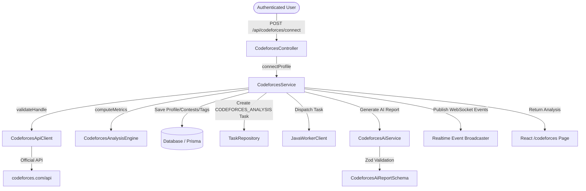

# Codeforces Intelligence & Contest Analytics

NexusFlow Codeforces Intelligence provides competitive programming analysis, contest rating tracking, problem difficulty distribution, topic strength evaluation, and Gemini AI recommendations.

---

## 1. Architecture Overview

---

## 2. API Integration

Codeforces integration communicates exclusively with official Codeforces REST endpoints:

- `user.info?handles={handle}`: Fetches user rating, max rating, rank, max rank, contribution, organization, and avatar.
- `user.rating?handle={handle}`: Fetches official contest rating history with rating before, rating after, rank, and timestamp.
- `user.status?handle={handle}&from=1&count=500}`: Fetches recent submissions, problem ratings, verdicts, and problem tags.

### Handle Validation
- Must be a non-empty string between 3 and 24 characters.
- Must contain only alphanumeric characters, underscores, hyphens, or dots (`^[a-zA-Z0-9_.-]+$`).

---

## 3. Deterministic Performance Metrics

All metrics are computed deterministically before passing structured signals to Gemini:

### Competitive Programming Score (0–100)
- **Rating Score (Max 40 pts)**: Scaled against Codeforces rating tiers (Newbie -> Specialist -> Expert -> Candidate Master -> Grandmaster).
- **Problem Volume & Difficulty Capability (Max 25 pts)**: Based on total solved count + volume of high-rating problems (1400+ rating).
- **Contest Experience & Peak Rating (Max 20 pts)**: Based on contest count + max rating peak.
- **Consistency Score (Max 15 pts)**: Scaled from recent activity and contest participation frequency.

### Rating Trend
- **IMPROVING**: Net gain of >= 40 points across recent contests.
- **DECLINING**: Net loss of <= -40 points across recent contests.
- **VOLATILE**: Rating swings >= 90 points in recent contests.
- **STABLE**: Fluctuations within [-40, 40] range.

### Topic Strength
- **STRONG**: Solved >= 12 problems OR (solved >= 6 and average problem rating >= 1500).
- **WEAK**: Solved < 4 problems OR (solved < 8 and average problem rating < 1100).
- **MODERATE**: Otherwise.

---

## 4. API Endpoints

| Endpoint | Method | Description |
| :--- | :--- | :--- |
| `/api/codeforces/connect` | `POST` | Connect Codeforces handle, fetch profile data & initiate background analysis task |
| `/api/codeforces/sync` | `POST` | Re-synchronize connected profile and refresh analysis |
| `/api/codeforces/profile` | `GET` | Get connected profile details and latest analysis |
| `/api/codeforces/statistics` | `GET` | Get profile statistics and computed deterministic metrics |
| `/api/codeforces/contests` | `GET` | Get historical contest performance and rating changes |
| `/api/codeforces/analysis` | `GET` | Get latest AI analysis report |

---

## 5. Real-Time WebSocket Events

The service emits real-time WebSocket events during profile synchronization:

- `codeforces:sync_started`: Emitted when connection or sync starts.
- `codeforces:sync_progress`: Emitted as progress increases (e.g. 50%).
- `codeforces:sync_completed`: Emitted when background sync finishes (100%).
- `codeforces:sync_failed`: Emitted on API or execution errors.
- `codeforces:analysis_completed`: Emitted when Gemini report is ready and persisted.

---

## 6. Security & User Isolation

- **Authentication Enforcement**: Every Codeforces resource is isolated by `req.user.id`.
- **IDOR Protection**: Requests cannot access or sync profiles of other users.
- **Strict Input Sanitization**: Handles are validated strictly. No arbitrary URLs or external proxies are allowed.
- **Mock Fallback**: Offline/testing handles (`nexusflow_test`, `demo_user`) provide deterministic test fixtures without hammering the external API.
