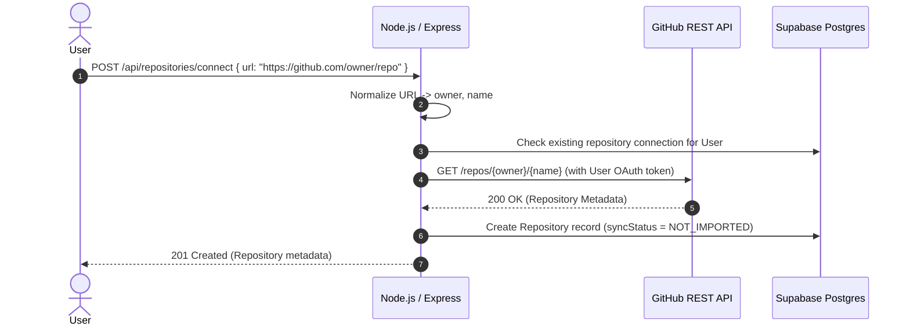
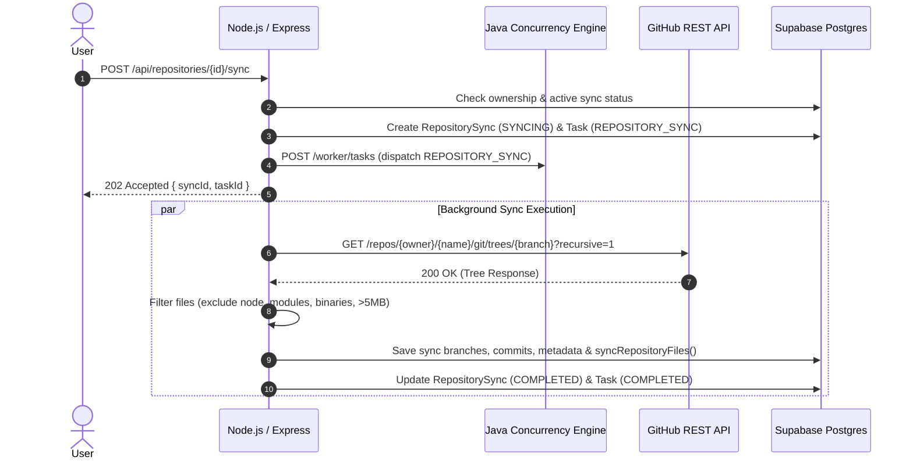

# PART 6 — GITHUB REPOSITORY INTEGRATION ARCHITECTURE

## Executive Overview

NexusFlow Part 6 implements the GitHub Repository Integration layer. It enables authenticated users to connect GitHub repositories, store normalized repository metadata, trigger background repository synchronization tasks executed by the Java Concurrency Engine, and track sync statuses and file trees.

---

## System Architecture

```
┌─────────────────────────────────────────────────────────┐
│                      Client / Frontend                   │
└────────────────────────────┬────────────────────────────┘
                             │ HTTP REST API
                             ▼
┌─────────────────────────────────────────────────────────┐
│                   Node.js + Express                      │
│  - GitHub API Client (OAuth Tokens, Rate Limit, Tree)   │
│  - Repository Service (Validation, Normalization)       │
│  - File Filter (Excludes node_modules, binaries, >5MB)  │
└──────────────┬───────────────────────────┬──────────────┘
               │                           │
   Dispatches  │                           │ Prisma ORM
   Task        ▼                           ▼
┌────────────────────────────┐    ┌───────────────────────┐
│     Java Worker Service    │    │  Supabase PostgreSQL  │
│  (Concurrently Executes    │    │  - Repositories       │
│   REPOSITORY_SYNC Task)    │    │  - RepositorySyncs    │
└────────────────────────────┘    │  - RepositoryFiles    │
                                  │  - Tasks              │
                                  └───────────────────────┘
```

### Architectural Principles
1. **Node.js Ownership**: All GitHub REST API communication (authentication, rate limits, tree traversal, repository metadata) is strictly owned and handled by Node.js.
2. **Java Engine Execution**: The Java Concurrency Engine is invoked solely to execute background tasks (`REPOSITORY_SYNC`) via thread pool priority scheduling.
3. **IDOR & Security**: Every repository access requires valid user authentication and explicit resource ownership verification.
4. **Idempotency**: Concurrent duplicate synchronization tasks for the same repository are explicitly prevented.

---

## Data Models (Prisma Schema)

```prisma
model Repository {
  id            String               @id @default(uuid())
  userId        String
  githubRepoId  BigInt?
  name          String
  owner         String
  fullName      String               @unique
  description   String?              @db.Text
  isPrivate     Boolean              @default(false)
  htmlUrl       String
  cloneUrl      String
  defaultBranch String               @default("main")
  starsCount    Int                  @default(0)
  forksCount    Int                  @default(0)
  openIssues    Int                  @default(0)
  language      String?
  visibility    String               @default("PUBLIC")
  syncStatus    SyncStatus           @default(NOT_IMPORTED)
  lastSyncedAt  DateTime?
  createdAt     DateTime             @default(now())
  updatedAt     DateTime             @updatedAt

  user          User                 @relation(fields: [userId], references: [id], onDelete: Cascade)
  syncs         RepositorySync[]
  files         RepositoryFile[]
  tasks         Task[]
}

model RepositorySync {
  id           String     @id @default(uuid())
  repositoryId String
  taskId       String?    @unique
  status       SyncStatus @default(SYNCING)
  startedAt    DateTime   @default(now())
  completedAt  DateTime?
  error        String?    @db.Text
  fileCount    Int        @default(0)
  createdAt    DateTime   @default(now())

  repository Repository @relation(fields: [repositoryId], references: [id], onDelete: Cascade)
}

model RepositoryFile {
  id           String   @id @default(uuid())
  repositoryId String
  path         String
  sha          String
  size         BigInt   @default(0)
  fileType     String   @default("file")
  language     String?
  lastModified DateTime @default(now())
  createdAt    DateTime @default(now())
  updatedAt    DateTime @updatedAt

  repository Repository @relation(fields: [repositoryId], references: [id], onDelete: Cascade)

  @@unique([repositoryId, path])
}
```

---

## Workflow Sequence Diagrams

### 1. Repository Connection Flow



### 2. Repository Sync Execution Flow



---

## API Routes & Endpoints

| Method | Endpoint | Description | Auth Required |
|---|---|---|---|
| `POST` | `/api/repositories/connect` | Connect a repository via owner/name, fullName, or GitHub URL | Yes |
| `GET` | `/api/repositories` | List connected repositories for authenticated user | Yes |
| `GET` | `/api/repositories/:id` | Get details for a specific repository | Yes |
| `POST` | `/api/repositories/:id/sync` | Trigger asynchronous repository sync | Yes |
| `GET` | `/api/repositories/:id/sync/:syncId` | Get status of a sync execution | Yes |
| `GET` | `/api/repositories/:id/files` | Get paginated synced files for repository | Yes |
| `DELETE` | `/api/repositories/:id` | Disconnect / delete repository | Yes |

---

## File Filtering & Tree Processing Rules

The `RepositoryFileFilter` utility filters file paths during synchronization:

1. **Excluded Directories**: `.git`, `node_modules`, `dist`, `build`, `target`, `coverage`, `vendor`, `.next`, `.idea`, `.vscode`, `.mvn`, `.gradle`, `bin`, `obj`, `__pycache__`.
2. **Excluded Extensions / Binary Files**:
   - Binaries/Executables: `.exe`, `.dll`, `.so`, `.dylib`, `.class`, `.jar`, `.pyc`, `.o`, `.a`
   - Archives: `.zip`, `.tar`, `.gz`, `.7z`, `.rar`
   - Media: `.png`, `.jpg`, `.jpeg`, `.gif`, `.ico`, `.svg`, `.mp3`, `.mp4`, `.pdf`
3. **Max File Size**: Default threshold is 5MB (`5 * 1024 * 1024` bytes).
4. **Language Detection**: Automatically maps file extension to programming language (e.g., `.java` -> Java, `.ts`/`.tsx` -> TypeScript, `.py` -> Python).

---

## Security & Protection Measures

- **No Secret Logging**: OAuth access tokens, passphrases, and private source code content are never logged.
- **IDOR Protection**: `assertResourceOwnership` enforces strictly that users can only view, sync, or delete their own connected repositories.
- **Input Sanitization**: Owner and repository names are validated against regular expressions to prevent path traversal or injection.

---

## Verification & Test Suite

All 38 tests across 4 suites pass cleanly:

```bash
npm test
```

- `tests/integration/githubIntegration.test.ts`: 13 integration tests covering connection, URL normalization, IDOR protection, task dispatching, file filtering, idempotency, and cascading deletion.
- `tests/integration/nodeJavaIntegration.test.ts`: 7 integration tests covering Node.js <-> Java worker HTTP communication.
- `tests/auth/auth.test.ts`: 17 tests covering auth, JWT, token rotation, and RBAC.
- `tests/e2e/taskFlow.test.ts`: E2E task dispatch flow verification.
